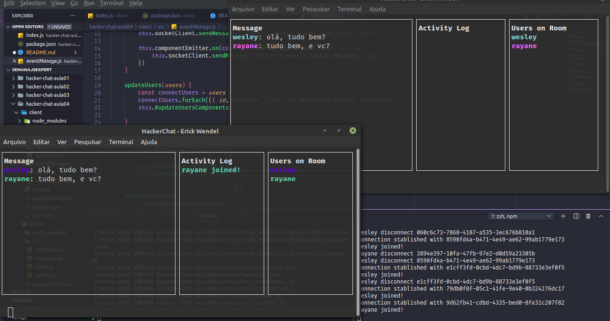
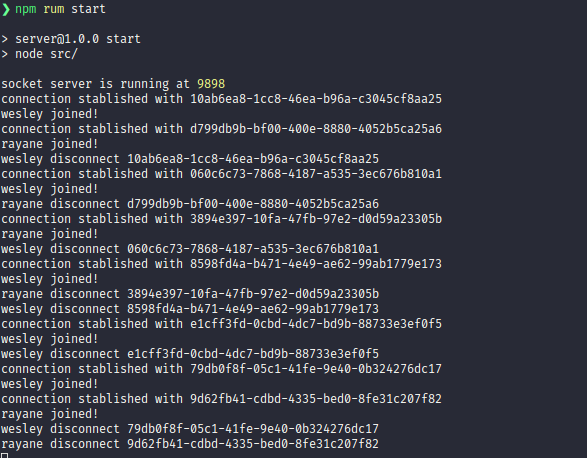

# Hacker-Chat

Projeto da Semana JSExpert, ministrado por [ErickWendel](https://www.linkedin.com/in/erickwendel/). O objetivo deste projeto foi criar um chat em terminais unix que se comunicam de ponta-a-ponta utilizando o protocolo web socket e sem utilizar qualquer lib.

## Conteúdos

- Protocolo web socket (sem socket.io)
- Interface no terminal com blessed
- Design Patern Build
- Eventos internos

## Screenshots




## Como rodar este projeto

Para um teste adequado é recomendado abrir 3 abas do seu terminal unix.

```bash
# primeirto terminal ira ficar responsável pelo servidor
# entre na pasta server
$ cd server/

# instale todas as dependências
$ npm install

# ligue o servidor
npm run start
```

Os dois restantes irão ser dois clients

```bash
# entre na pasta client
$ cd client/

# instale todas as dependências
$ npm install

# entre com usuário 1
npm run user1

# entre com usuário 2
npm run user2
```